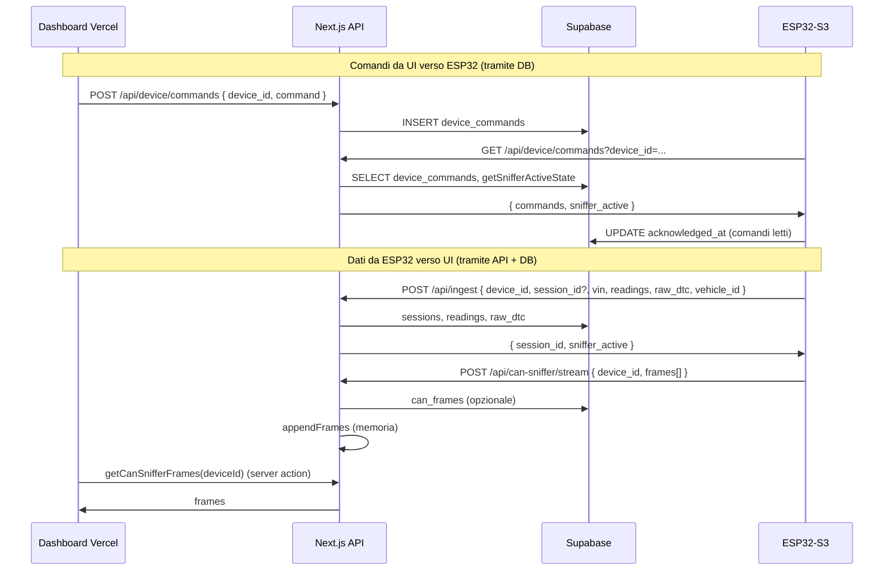

# Architettura UI ↔ ESP32: comunicazione e estensione senza reflash

L’obiettivo è **non riprogrammare l’ESP32** per ogni nuova funzione: configurazione, comandi e dati di diagnostica sono gestiti da **database (Supabase)** e **API (Vercel)**. Nuove funzionalità e UI si aggiungono lato backend e frontend; il firmware resta compatibile finché rispetta il contratto delle API.

---

## Flusso comunicazione UI ↔ ESP32

- **UI → ESP32**: la dashboard non parla direttamente con l’ESP32. Inserisce comandi in **`device_commands`** (e lo stato sniffer viene derivato da `set_sniffer`). L’ESP32, a ogni poll (GET `/api/device/commands`), riceve i comandi e `sniffer_active`.
- **ESP32 → UI**: l’ESP32 invia dati con **POST `/api/ingest`** e **POST `/api/can-sniffer/stream`**. Le API scrivono su Supabase (sessions, readings, can_frames) e/o su store in memoria. La UI legge da API/DB (sessioni, metriche, frame CAN).

---

## Contratti attuali

### 1. Comandi dispositivo (DB + GET response)

- **Tabella**: `device_commands` (device_id, command, payload, acknowledged_at).
- **Comandi gestiti dal firmware**:
  - `start_session`: avvia una nuova sessione (prossimo ingest senza session_id).
  - `set_sniffer` con `payload: { active: true|false }`: lo stato viene letto da `getSnifferActiveState` e restituito in GET come `sniffer_active`.
- **GET** `/api/device/commands?device_id=xxx` (header `x-api-key` per il device) restituisce:
  - `commands`: righe non ancora acknowledge.
  - `sniffer_active`: booleano derivato dall’ultimo `set_sniffer` per quel device.
- Dopo la lettura, l’API marca i comandi con `acknowledged_at`.

### 2. Ingest (ESP32 → backend)

- **POST** `/api/ingest`: body con `device_id`, opzionali `session_id`, `vin`, `vehicle_id`, `readings[]`, `raw_dtc[]`.
- La risposta include **`session_id`** e **`sniffer_active`** così l’ESP32 può aggiornare sessione e stato sniffer senza fare un secondo GET a `/api/device/commands` se non serve.

### 3. CAN Sniffer

- **UI**: "Avvia CAN Sniffer" → `subscribeSniffer(deviceId)` → INSERT `set_sniffer` con `active: true`. "Ferma" → INSERT con `active: false`.
- **ESP32**: se `sniffer_active` è true (da ingest o da GET commands), invia batch a **POST** `/api/can-sniffer/stream` con `device_id` e `frames[]`.
- **UI**: legge i frame via server action `getCanSnifferFrames(deviceId)` (store in memoria + opzionale persist su `can_frames`).

### 4. Librerie veicolo (no reflash)

- **Vehicle detection**: ESP32 invia fingerprint CAN a **POST** `/api/vehicle/detect`, riceve `vehicle_id` e (se serve) usa **GET** `/api/libs/{vehicle_id}` per scaricare la lib.
- La lib viene salvata in **LittleFS** sul device. Nuovi veicoli o nuovi segnali si aggiungono in **Supabase** (vehicles, signals, dtc) e/o in **Storage**; al prossimo avvio/detect l’ESP32 scarica la lib aggiornata. **Nessun reflash** per nuovi modelli/segnali.

---

## Come estendere senza riprogrammare l’ESP32

1. **Nuovi veicoli / segnali / DTC**  
   Aggiungi/aggiorna dati in Supabase (e eventualmente lib in Storage). L’ESP32 continua a usare vehicle detect e GET lib; alla prossima connessione riceve la lib aggiornata.

2. **Nuova UI (dashboard, report, grafici)**  
   Solo deploy su Vercel. L’ESP32 non cambia.

3. **Nuovi comandi dispositivo**  
   Puoi inserire in `device_commands` nuovi `command` (es. `set_interval`, `read_did_once`). Il firmware attuale ignora i comandi sconosciuti. Per **usarli** serve **un solo** aggiornamento firmware che interpreti quel comando; dopo quello, il valore/trigger può arrivare sempre da DB/API (nessun ulteriore reflash).

4. **Configurazione “soft” (futura)**  
   Si può introdurre un endpoint tipo **GET** `/api/device/config?device_id=xxx` che restituisce JSON (es. `ingest_interval_ms`, `sniffer_active`, `lib_version`). Il firmware dovrà supportare la lettura di questi campi (una volta implementato, ogni modifica è solo lato DB/API).

---

## Riepilogo

- **UI comunica con l’ESP32 solo tramite database e API**: comandi in `device_commands`, stato sniffer da `set_sniffer`, dati da ingest e can-sniffer stream.
- **Integrare nuove funzioni e UI** avviene con **Vercel + Supabase (e Storage)**; l’ESP32 va riprogrammato solo quando si introduce un **nuovo tipo di comando o di protocollo** che il firmware non conosce ancora.
